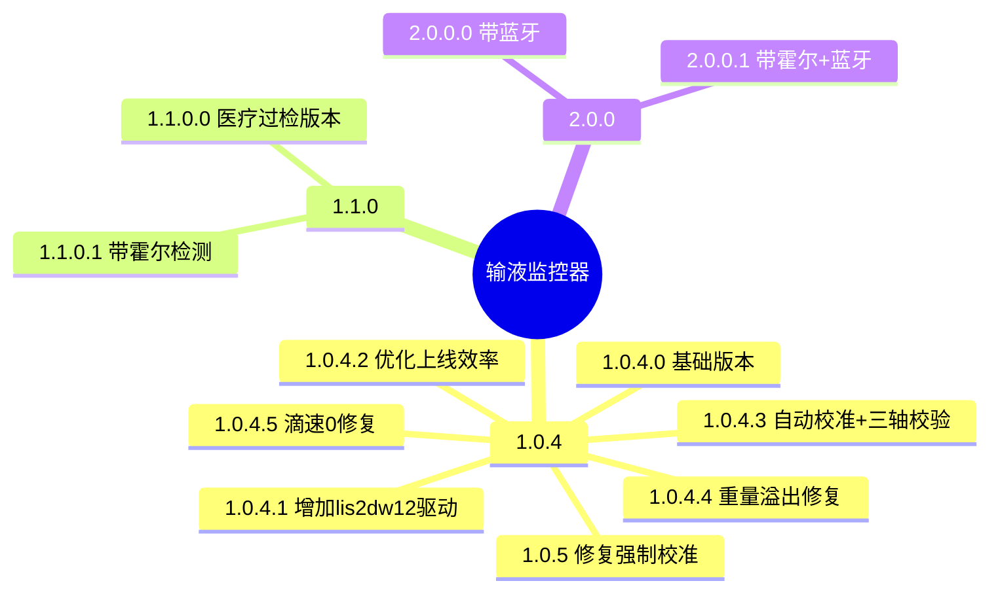

## 1 版本脉络

## 2 版本详情

### 2.1 系列

| 版本 | 主要变更 | 状态 |
|------|---------|------|
| 1.0.4.0 | 基础版本，在最新基站新系统显示为 1.0.4.0 | 已发布 |
| 1.0.5 | 修复强制校准问题，遵义人民医院使用 | 已发布 |
| 1.0.4.1 | 1. G-Sensor 增加 LIS2DW12 驱动，向下兼容 BMA253；2. 增加真实版本号 | 已发布 |
| 1.0.4.2 | 1. 优化上线效率；2. 优化重量波动上报滴速逻辑；3. 优化手动校准后重量不准确问题 | 已发布 |
| 1.0.4.3 | 1. 优化自动校准需空勾悬挂 3min 以上，解决平放导致出现重量；2. 优化手动校准逻辑，增加抗干扰能力；3. 优化上报重量逻辑，提高平滑度；4. 加入启动滴数逻辑（重量突变触发）；5. 加入三轴校验机制；6. 修复静电导致设备异常 | 已发布 |
| 1.0.4.4 | 1. 重量超 4300g 溢出 bug 修复；2. 模式阈值修改（睡眠→正常 >21g，正常→睡眠 <19g）；3. 静电导致设备异常修复；4. 自动零偏逻辑 | — |
| 1.0.4.5 | 1. 修复中途重量波动导致滴速出现 0；2. 下载器下载限制为开机 10s，防止静电引起故障 | — |

### 2.2 系列

| 版本 | 主要变更 | 状态 |
|------|---------|------|
| 1.1.0.0 | 医疗过检版本变更 | — |
| 1.1.0.1 | 带霍尔检测版本 | — |

### 2.3 系列

| 版本 | 主要变更 | 状态 |
|------|---------|------|
| 2.0.0.0 | 带蓝牙版本 | — |
| 2.0.0.1 | 带霍尔版本 | — |
