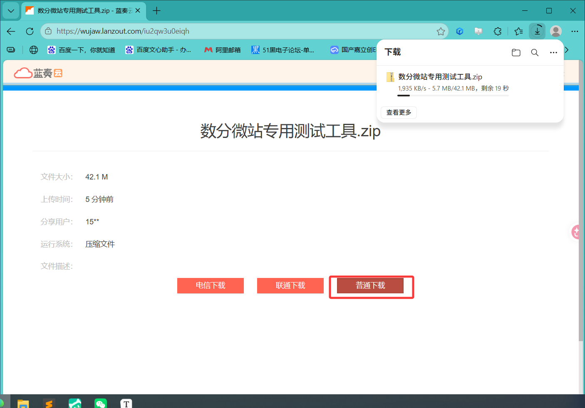

## 1 概述

本手册面向产线操作人员，介绍如何使用「数分微站专用测试软件」对数分微站设备进行信号强度采集与版本校验。

软件提供两种测试模式：

| 模式 | 适用场景 | 核心功能 | 是否写入 Excel |
|------|----------|----------|---------------|
| 成品测试 | 成品出厂检验 | 采集信号强度 → 手动输入手机蓝牙信号 → 写入记录表 | 是 |
| 半成品测试 | 半成品工序检验 | 采集信号强度 + 自动校验设备版本号 | 否 |

---

## 2 环境准备

### 2.1 硬件要求

| 项目 | 要求 |
|------|------|
| 电脑 | Windows 10 / 11 |
| 串口连接 | USB 转 TTL 串口线，连接数分微站调试口 |
| 通信参数 | 波特率 115200，数据位 8，无校验，停止位 1 |

### 2.2 软件准备

- 测试软件主程序：`数分微站生产专用测试程序.exe 

- 复制下载地址到浏览器的地址框回车：

```
  https://wujaw.lanzout.com/iu2qw3u0eiqh
  ```




- Excel 记录文件：用于成品测试结果写入（`.xlsx` 格式）

> <span style="color: red;">**注意：成品测试前必须选择好 Excel 文件，否则无法启动测试。半成品测试不需要 Excel 文件。**</span>

---

## 3 软件界面介绍

软件启动后，界面分为左右两部分：


### 3.1 左侧 — 配置与操作区

从上到下依次为：

| 配置项 | 说明 | 示例值 |
|--------|------|--------|
| 串口号 | 选择已连接的 COM 口（自动扫描） | COM20 |
| 写入文件 | 选择 Excel 记录文件（点击右侧「…」按钮浏览） | 测试记录.xlsx |
| 蓝牙测试标签 | 待测试的蓝牙标签 hex 编码 | 56 00 00 99 |
| 基站信号阈值 | 基站信号强度合格线（dBm），低于此值触发警告 | -50 |
| 标签信号强度阈值 | 蓝牙标签信号强度合格线（dBm） | -30 |
| 信号采集包数 | 成品测试需采集的信号包数量，达到后自动结束 | 10 |
| 超时时间(秒) | 未收到信号数据时的超时退出时间 | 20 |
| 主机版本00 | 半成品测试校验用 — 主机版本号 | 00 01 00 07 |
| 从机版本 01 | 半成品测试校验用 — 从机 01 版本号 | 01 01 00 00 |
| 从机版本02 | 半成品测试校验用 — 从机 02 版本号 | 02 01 00 01 |
| 数分微站号 | 待测设备的微站号 hex 编码 | 69 00 00 08 |

操作按钮（位于配置项下方）：


| 按钮 | 颜色 | 功能 |
|------|------|------|
| 成品测试 | 蓝色 | 启动成品测试流程 |
| 半成品测试 | 蓝色 | 启动半成品测试流程 |
| 停止测试 | 红色 | 中止当前测试 |

> **提示：** 所有配置项在修改后会自动保存，下次启动软件时无需重新填写。

### 3.2 左侧 — 状态显示区

按钮下方依次为：

- **进度条**：显示当前测试进度（百分比 + 计数/倒计时）
- **与基站信号**：实时显示基站信号强度（dBm）及采集次数（×N）
- **与蓝牙标签信号**：实时显示蓝牙标签信号强度（dBm）及采集次数（×N）
- **版本信息面板**（仅半成品测试显示）：显示主机版本00、从机版本01、从机版本02 的采集值及校验状态
- **警告提示**：信号低于阈值时显示红色警告文字


### 3.3 右侧 — 实时日志区

以深色终端风格显示测试过程中的实时数据：

- **青色**：信息提示
- **绿色**：操作成功
- **橙色**：警告信息
- **粉红色**：错误信息
- **紫底白字**：蓝牙标签匹配数据
- **绿底白字**：数分微站号匹配数据
- **红底白字**：蓝牙信号强度字节
- **黄底黑字**：末尾字节（基站信号强度）


---

## 4 成品测试操作流程

### 4.1 测试前配置

**步骤一：连接设备**

将 USB 转 TTL 串口线连接到数分微站的调试口，确认电脑已识别到 COM 口。

**步骤二：选择串口号**

在「串口号」下拉框中选择对应的 COM 口。

<span style="color: red;">**注意：先插入串口再打开软件，否则可能列表不显示。也可以重启软件解决**</span>


**步骤三：选择写入文件**

点击「写入文件」右侧的「…」按钮，选择用于记录测试结果的 Excel 文件。


在这里我随便选择了一个


**步骤四：填写测试参数**

根据待测设备填写以下参数：

- 蓝牙测试标签：当前使用测试的蓝牙标签 
- 数分微站号：待测设备的微站号
- 基站信号阈值 / 标签信号强度阈值：按生产标准填写
- 信号采集包数：建议保持默认值 10
- 超时时间：建议保持默认值 20 秒


### 4.2 执行测试

**步骤五：启动测试**

确认配置无误后，点击「成品测试」按钮。

软件自动打开串口开始采集数据，此时：

- 所有配置项变为不可编辑状态（锁定）
- 进度条开始按采集包数推进
- 日志区实时显示匹配到的信号数据
- 信号强度区实时刷新基站信号和蓝牙标签信号值


**步骤六：等待采集完成**

软件会持续采集信号数据，当蓝牙标签信号采集次数达到设定的「信号采集包数」时，进度条显示 100%，采集自动结束。

> <span style="color: red;">**注意：若超过设定的超时时间仍未收到任何信号数据，软件将自动记录超时并退出测试。**</span>
>
> 这种情况一般是微站号或者蓝牙标签号输入错误。
>
> 

**步骤七：输入手机蓝牙信号**

采集完成后，软件弹出输入框，提示输入手机蓝牙信号强度（dBm）。


使用手机靠近设备测量蓝牙信号强度，将数值填入弹窗后点击确定。

**步骤八：确认写入结果**

软件自动将测试数据写入 Excel 文件，日志区显示写入内容摘要：

| 列名 | 数据来源 |
|------|----------|
| 编号 | 数分微站号（自动去除空格） |
| 与基站信号强度 | 采集期间基站信号均值（自动计算） |
| 与蓝牙标签信号强度 | 采集期间蓝牙标签信号均值（自动计算） |
| 蓝牙信号强度 | 步骤七手动输入的手机蓝牙信号值 |
| 备注 | 信号低于阈值时自动标注警告信息 |


> <span style="color: red;">**注意：如果 Excel 文件正处于打开状态，写入会失败。此时界面会出现「重新写入」按钮，请先关闭 Excel 文件，再点击该按钮重新写入。**</span>


**步骤九：更换设备**

写入完成后，配置项自动解锁。更换下一台设备，修改「数分微站号」后重复步骤五即可。

### 4.3 超时处理

若在设定的超时时间内未收到信号数据，软件会：

1. 进度条显示「超时」
2. 日志区显示超时信息
3. 自动在 Excel 中写入该设备编号，备注栏标注「蓝牙标签或微站没有数据上报」
4. 解锁配置，等待下一次测试

遇到超时时，请检查：

- 串口连接是否正常
- 设备是否已上电并正常工作
- 蓝牙测试标签和数分微站号是否填写正确

---

## 5 半成品测试操作流程

### 5.1 测试前配置

**步骤一：选择串口号**

在「串口号」下拉框中选择对应的 COM 口。

**步骤二：填写设备参数**

- 数分微站号：待测设备的微站号
- 主机版本00 / 从机版本 01 / 从机版本02：填写当前批次的标准版本号，软件将自动对比采集到的版本


> <span style="color: red;">**注意：数分微站号前两位为「65」时，软件只校验主机版本00 和从机版本01；其他编号需校验全部三个版本号。请根据设备型号正确填写。**</span>

### 5.2 执行测试

**步骤三：启动测试**

点击「半成品测试」按钮。软件打开串口开始采集，此时：

- 配置项锁定
- 版本信息面板出现，显示「主机版本00」「从机版本01」「从机版本02」三行
- 进度条开始 4 分钟倒计时
- 日志区实时显示信号数据和版本信息


**步骤四：等待版本采集**

软件持续监听串口数据，自动提取设备上报的版本号。每采集到一个版本号，对应行会从「—」更新为实际值。

- 当所有版本号采集完成 → 进度条跳至 100%，测试自动结束
- 当 4 分钟倒计时结束仍未采集完 → 显示「4分钟未采集到」，测试自动结束

**步骤五：查看校验结果**

版本采集完成后，软件自动将采集值与配置的标准版本号进行比对：

| 显示结果 | 含义 |
|----------|------|
| 测试成功，版本正常（绿色） | 所有版本号与配置一致 |
| 版本异常（红色） | 存在版本号与配置不一致 |

同时，信号强度区会显示采集期间的信号值，若低于阈值则显示红色警告。


> **说明：** 半成品测试**不写入 Excel 文件**，仅进行版本校验和信号评估。测试结果以界面显示为准，请操作人员目视确认。

**步骤六：更换设备**

测试结束后配置项自动解锁。更换下一台设备，修改「数分微站号」后重复步骤三即可。

---

## 6 中止测试

在测试过程中，如需中断当前测试（如设备异常、参数填错等），点击「停止测试」按钮：

- 软件立即关闭串口，停止数据采集
- 进度条复位
- 版本信息面板隐藏
- 所有配置项解锁
- 信号显示清零

中止测试不会写入任何数据到 Excel。


---

## 7 常见问题

### 7.1 无法打开串口

**现象：** 日志区显示「无法打开串口」或「串口被占用」。

**处理：**
1. 检查串口线是否已正确连接
2. 确认没有其他软件（如串口调试助手）正在使用该 COM 口
3. 拔插 USB 串口线后重新选择 COM 口

### 7.2 超时无数据

**现象：** 测试启动后超过超时时间仍未收到信号数据，进度条显示「超时」。

**处理：**
1. 确认设备已上电并正常工作
2. 检查「蓝牙测试标签」和「数分微站号」是否与实际设备匹配
3. 检查串口线 RX/TX 是否接反

### 7.3 Excel 写入失败

**现象：** 日志区提示文件被占用，界面出现「重新写入」按钮。

**处理：**
1. 关闭正在打开的 Excel 文件
2. 点击界面上的「重新写入」按钮
3. 若仍失败，检查 Excel 文件是否被其他程序锁定

### 7.4 版本校验异常

**现象：** 半成品测试结果显示「版本异常」。

**处理：**
1. 查看日志区，确认是哪个版本号不匹配
2. 核对配置区填写的标准版本号是否正确
3. 若设备版本确实异常，标记该设备为不良品

### 7.5 信号强度警告

**现象：** 界面底部显示红色警告「基站信号弱」或「与蓝牙标签信号弱」。

**处理：**
1. 检查设备天线是否安装到位
2. 检查测试环境是否有强干扰源
3. 确认蓝牙标签与设备之间的距离在合理范围内
4. 信号低于阈值的设备仍会写入 Excel（成品测试）或显示结果（半成品测试），但备注栏会标注警告信息，请操作人员根据生产标准判定是否合格

---

## 8 版本记录

| 版本 | 日期 | 说明 |
|------|------|------|
| v1.0 | 2026-07-02 | 初始版本，支持成品测试和半成品测试 |
